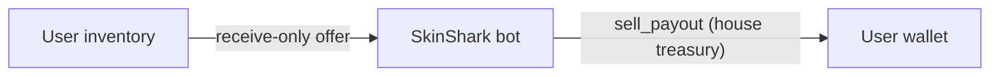

Selling is the inverse of buying: a user hands CS2 items to a SkinShark-operated
Steam bot and their wallet is credited with a payout. You quote the user from our
payout book, submit the sale at the exact quote, and the user accepts a single
Steam trade offer from the bot. There's no marketplace listing involved — SkinShark
is the counterparty.

All three endpoints are sub-user-context, so from a merchant key you send
`On-Behalf-Of: <subUserId | externalId>`. The user must have a **linked Steam
account** — selling always targets their own saved trade URL and can never redirect
items elsewhere.

## Mental model



## The flow

<Steps>
  <Step title="Price the sale">
    Read `GET /market/sell/inventory` (with `On-Behalf-Of`) to get the user's tradable
    items, each with our USD offer in `price`. Only items with `accepted: true` (a quote
    exists **and** the item is tradable) can be sold. To price without reading the
    inventory — e.g. to render a payout table — use `GET /market/sell/prices`, the raw
    payout book keyed by `marketHashName`.
  </Step>
  <Step title="Submit the sale">
    `POST /market/sell` with the items to sell. Reference each item by its encoded `id`
    (from the inventory read) or raw `assetid` — exactly one — plus the exact `price` you
    were quoted. The price is a **cent-exact lock**: if the quote moved, that submission
    fails with `PRICE_MISMATCH`, so re-read and retry. The Trade returns immediately with
    status `initiated`. No money moves yet.
  </Step>
  <Step title="User accepts the Steam offer">
    SkinShark picks an available bot and sends the user a **receive-only** Steam trade
    offer (the bot gives nothing, only receives). The user must accept it in Steam.
    Status moves `initiated → active` once the offer is live.
  </Step>
  <Step title="Hold, then payout">
    After the user accepts, the items sit in Steam's trade-protection window and the
    Trade is `hold`. The payout — one `sell_payout` from house treasury — is credited
    **once**: at `hold` if your account's instant-credit setting is on, otherwise at
    `completed` when the hold clears. Watch `trade.*` WebSocket events or poll
    `GET /market/transactions/{id}` for the transition.
  </Step>
</Steps>

## Status lifecycle

A sell trade uses the same [`TradeStatus`](/reference/data-models) values as a buy, but
travels a different path:

| Status | Meaning |
|---|---|
| `initiated` | Sale created; the bot offer is being sent. |
| `active` | The receive-only Steam offer is live at the user — waiting for them to accept. |
| `hold` | User accepted; items are in Steam's trade-protection window. Payout credits here if instant-credit is on. |
| `completed` | Hold cleared; payout settled. |
| `failed` | The offer couldn't be sent/accepted (e.g. it expired). No money moved. |
| `canceled` / `declined` | The user canceled or declined the offer before delivery. No money moved. |
| `reverted` | Delivered then recalled by Steam/support. **SkinShark absorbs the loss — the user's payout is never clawed back.** |

## Payout timing

The credit is a single ledger post and lands exactly once:

- **Instant credit on** — the user is paid at `hold`, the moment they accept.
- **Instant credit off** (default) — the user is paid at `completed`, when the trade-hold
  window clears.

`settledAt` on the Trade marks when the payout posted. `totalPrice` is the payout in the
wallet currency, converted at an FX rate locked at submit time.

## Code template

```ts
async function sellForUser(input: {
  subUserId: string;          // On-Behalf-Of target
  externalId: string;         // your correlation id
}) {
  // 1. Price the user's inventory
  const inv = await api<{ items: Array<{ id: string; price: number; accepted: boolean }> }>(
    "/market/sell/inventory",
    { headers: { "On-Behalf-Of": input.subUserId } },
  );
  const sellable = inv.items.filter((i) => i.accepted);
  if (sellable.length === 0) return null;

  // 2. Submit at the exact quoted price (cent-exact lock)
  return api<{ id: string; status: string; totalPrice: number; currency: string }>(
    "/market/sell",
    {
      method: "POST",
      headers: { "On-Behalf-Of": input.subUserId },
      body: JSON.stringify({
        items: sellable.map((i) => ({ id: i.id, price: i.price.toFixed(2) })),
        externalId: input.externalId,
      }),
    },
  );
  // 3. The user now accepts the Steam offer; watch trade.* events for hold → completed.
}
```

<Info>
  With the [TypeScript SDK](/guides/sdk): `client.as(subUserId).market.sell.inventory()`,
  `.sell.prices()`, and `.sell.create(items, externalId)`.
</Info>

## Errors

Beyond the shared [error codes](/reference/errors), selling can return:

| Key | When |
|---|---|
| `STEAM_ACCOUNT_REQUIRED` | The user has no linked Steam account. |
| `USER_NOT_TRADEABLE` | The user's Steam account can't trade (ban, limit, restriction). |
| `INVENTORY_PRIVATE` | The user's Steam inventory is private or unreadable. |
| `ESCROW_NOT_ALLOWED` | The user's account has a trade hold (escrow) enabled. |
| `NO_OFFER_FOUND` | No payout quote for one or more of the submitted items. |
| `ITEMS_NOT_ACCEPTED` | An item isn't in the inventory or isn't tradable. |
| `PRICE_MISMATCH` | A submitted price no longer matches the live quote — re-read and retry. |
| `NO_BOTS_AVAILABLE` / `PRICING_UNAVAILABLE` / `STEAM_UNAVAILABLE` | Transient — retry shortly. |
