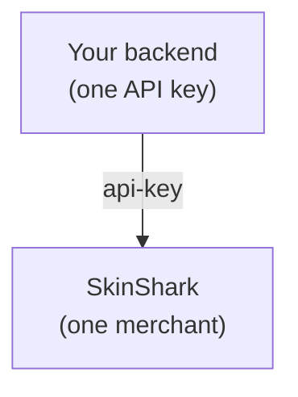

Core API is the single-account integration model. Your merchant key is the
only identity that exists — every trade, deposit, and withdrawal posts to
that one account. No sub-users, no `On-Behalf-Of`, no inter-account
transfers.

This is the right starting point if you operate one storefront, one
treasury, one consolidated ledger.

## Mental model



## When this fits

- One product, one storefront, one treasury.
- You don't need per-customer balance isolation in SkinShark.
- All reconciliation can happen at one merchant level.
- Operations is a single team, not multi-tenant.

If any of these *don't* apply, jump to
[Full Platform](/integration/full-platform).

## Endpoints you'll use

All sub-user-context routes work without an `On-Behalf-Of` header — they
run as the merchant. So you only ever need:

| Action | Endpoint |
|---|---|
| Read merchant profile + balances | `GET /merchant` |
| Read full ledger | `GET /merchant/ledger` |
| Search the catalog | `GET /market/search` |
| Live listings for an item | `GET /market/items/{itemId}/listings` |
| Buy specific listings | `POST /market/buy` |
| Buy by item, server picks fills | `POST /market/buy/quick` |
| List trades | `GET /market/trades` (or `GET /merchant/trades`) |
| Get trade detail | `GET /market/trades/{tradeId}` |
| Stats (GMV, fees) | `GET /merchant/stats` |
| Deposit (Gate Pay / on-ramp / crypto) | `POST /user/wallet/deposit/...` |

## Skip these (for now)

These endpoints are real, just not relevant in Core API mode:

- `/merchant/users/*` — sub-user CRUD and funding
- `/merchant/users/{id}/wallet` — sub-user wallet reads
- `On-Behalf-Of` header — never needed

You can adopt them later without breaking anything; they're additive.

## Daily operation

A typical day in Core API:

<Steps>
  <Step title="User browses">
    Your frontend calls `GET /market/search` and `GET /market/items/{itemId}/listings`
    to render inventory.
  </Step>
  <Step title="User buys">
    `POST /market/buy` debits your merchant wallet by `totalPrice` and
    creates a trade.
  </Step>
  <Step title="Server confirms">
    A `trade.completed` webhook fires (or your WebSocket subscriber sees
    `trade.completed`). Persist the trade against your own order table by
    `externalId`.
  </Step>
  <Step title="Reconcile">
    Nightly job calls `GET /merchant/ledger?type=spot` and `GET /merchant/stats`
    against yesterday's window for accounting.
  </Step>
  <Step title="Top up">
    When the merchant balance dips, deposit via Gate Pay / on-ramp /
    crypto. The deposit credits the merchant wallet directly.
  </Step>
</Steps>

## Code template

```ts
import { randomUUID } from "node:crypto";

async function checkoutOnSkinShark(input: {
  checkoutId: string;       // your order ID
  listingId: string;
  maxPrice: string;         // decimal string
}) {
  // Buy as the merchant (no On-Behalf-Of)
  return api<{ id: string; status: string; totalPrice: number }>(
    "/market/buy",
    {
      method: "POST",
      body: JSON.stringify({
        items: [{ listingId: input.listingId, maxPrice: input.maxPrice }],
        externalId: input.checkoutId,
      }),
    },
  );
}

async function reconcileLastDay() {
  const since = new Date(Date.now() - 24 * 60 * 60 * 1000).toISOString();
  const stats = await api<{
    totals: { gmv: number; feesEarned: number; tradeCount: number };
  }>(`/merchant/stats?from=${encodeURIComponent(since)}`);
  return stats.totals;
}
```

## What you give up

- **No tenant isolation.** All trades show up under one merchant. If a
  customer disputes, they're not separable in SkinShark's view.
- **One ledger.** Per-customer accounting is your job, not SkinShark's.
- **Migration cost later.** If your business needs per-customer wallets,
  you'll move to Full Platform — usually a one-time refactor where you
  swap one `api()` call signature to take a sub-user ID.

## When to graduate

Move to [Full Platform](/integration/full-platform) when you need:

- Per-customer balance isolation (chargeback containment, audit clarity).
- Multi-tenant reporting in the merchant dashboard.
- Per-customer fee overrides.
- Self-service crypto deposits per customer.

The migration is mostly mechanical: provision a sub-user per customer,
add `On-Behalf-Of`, route customer-attributable calls there. The catalog
and trade primitives don't change.
