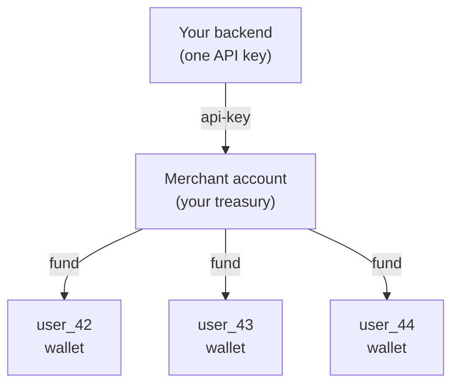

Full Platform is the multi-tenant model. You hold one merchant API key.
Every end customer of yours gets a sub-user under it: their own wallet,
their own trade history, their own Steam trade URLs. Money flows from your
merchant treasury to sub-users via internal transfers, or directly to a
sub-user via deposit.

## Mental model



Acting as a sub-user from your single merchant key is one header:

```http
On-Behalf-Of: user_42
```

See [Acting on behalf of a sub-user](/guides/on-behalf-of).

## When this fits

- You're building a product **on top of** SkinShark and reselling to your
  own users.
- Each user needs their own balance, trade history, and Steam connection.
- You want chargeback / dispute isolation per user.
- You want per-user reporting in the SkinShark dashboard.

## Provisioning

Create one sub-user per end customer when they sign up. Use your own
internal user ID as `externalId` so you never have to persist the
SkinShark UUID.

```ts
async function onboardCustomer(internalUserId: string, email: string) {
  return api<{ id: string; externalId: string; currency: "USD" | "EUR" }>(
    "/merchant/users",
    {
      method: "POST",
      body: JSON.stringify({
        email,
        externalId: internalUserId,
      }),
    },
  );
}
```

<Note>
`POST /merchant/users` is API-key-auth only. Provisioning happens
server-to-server, never from a dashboard session.
</Note>

## Funding pattern

There are two ways to put money in a sub-user's wallet:

### (a) Internal transfer from merchant treasury

You hold balance centrally and dispense it as customers need it. Idempotent.

```ts
import { randomUUID } from "node:crypto";

async function fundOnCheckout(internalUserId: string, amount: string, checkoutId: string) {
  return api<{ transactionId: string; idempotent: boolean }>(
    `/merchant/users/${internalUserId}/fund`,
    {
      method: "POST",
      headers: { "idempotency-key": `checkout:${checkoutId}` },
      body: JSON.stringify({ amount }),
    },
  );
}
```

### (b) Direct deposit from the customer

The customer pays SkinShark directly via Gate Pay / on-ramp / crypto. Run
under `On-Behalf-Of` so the deposit credits the sub-user.

```ts
async function quoteCryptoDeposit(internalUserId: string, amount: number) {
  return api<{
    chains: Record<string, { feeCents: number; receiveAmount: number; gasGwei: number }>;
  }>(
    "/user/wallet/deposit/crypto/quote",
    {
      method: "POST",
      body: JSON.stringify({ token: "USDT", amount }),
    },
    internalUserId,
  );
}
```

Most platforms use (a) for in-product purchases and (b) for top-ups
initiated by the customer.

## Buy flow

Always tag with both the sub-user (`On-Behalf-Of`) and your own checkout
ID (`externalId`). The first scopes wallet/trade-URL/history. The second
makes retries idempotent and reconciliation trivial.

```ts
async function buyForCustomer(input: {
  internalUserId: string;
  checkoutId: string;
  listingId: string;
  maxPrice: string;
}) {
  return api<{ id: string; status: string; totalPrice: number }>(
    "/market/buy",
    {
      method: "POST",
      headers: { "on-behalf-of": input.internalUserId },
      body: JSON.stringify({
        items: [{ listingId: input.listingId, maxPrice: input.maxPrice }],
        externalId: input.checkoutId,
      }),
    },
  );
}
```

## Reading customer state

| Question | Endpoint |
|---|---|
| What's this customer's balance? | `GET /merchant/users/{id}/wallet` |
| Their trade history? | `GET /merchant/users/{id}/trades` |
| Their full ledger? | `GET /merchant/users/{id}/ledger` |
| Cross-customer aggregate? | `GET /merchant/stats?from=&to=` |
| All recent trades? | `GET /merchant/trades?cursor=` |
| Top GMV customers this month? | `GET /merchant/stats` → `bySubUser` |

Notice these are all on the **merchant** prefix — no `On-Behalf-Of`
needed because the merchant is reading their own scope. `On-Behalf-Of` is
for *acting as* a sub-user (buys, deposits), not reading their data.

## Suspension and offboarding

```ts
// Suspend (read-only — login + buy blocked)
await api(`/merchant/users/${internalUserId}/suspend`, { method: "POST" });

// Reactivate
await api(`/merchant/users/${internalUserId}/reactivate`, { method: "POST" });

// Soft-delete (status=deleted, wallet closed)
await api(`/merchant/users/${internalUserId}`, { method: "DELETE" });
```

Suspension is reversible; deletion is not. After deletion, the wallet's
balance must be zero — withdraw or sweep first.

## Treasury and fees

Your merchant has two wallets:

- **`spot`** — what you fund customers from, what direct merchant trades
  debit.
- **`earnings`** — credited at trade settlement when your `merchantFeeBps`
  > 0. This is your cut on customer purchases.

```ts
const merchant = await api<{
  wallets: {
    spot: { currency: string; balance: number };
    earnings: { currency: string; balance: number };
  };
}>("/merchant");
```

Read fees with `GET /merchant/fees`. Fee changes are dashboard-only — the
API exposes them read-only so you can render them in your UI without
giving an automated client the power to change them.

## Reconciliation pattern

Nightly job, in pseudocode:

```ts
async function nightly() {
  const since = startOfYesterdayISO();
  const until = startOfTodayISO();

  // 1. Aggregate stats
  const stats = await api<{
    totals: { gmv: number; feesEarned: number; tradeCount: number };
    bySubUser: Array<{ externalId: string; gmv: number }>;
  }>(`/merchant/stats?from=${since}&to=${until}`);

  // 2. Walk all trades that completed in the window for full ledger
  let cursor: string | undefined;
  const trades = [];
  do {
    const page = await api<{
      items: Array<{ id: string; externalId: string | null; settledAt?: string }>;
      nextCursor: string | null;
    }>(
      `/merchant/trades?status=completed&from=${since}&to=${until}&limit=100` +
        (cursor ? `&cursor=${cursor}` : ""),
    );
    trades.push(...page.items);
    cursor = page.nextCursor ?? undefined;
  } while (cursor);

  // 3. Match against your own order table by externalId
  for (const t of trades) {
    if (!t.externalId) continue;
    await markCheckoutSettled(t.externalId, t.settledAt);
  }
}
```

## Common mistakes

<AccordionGroup>
  <Accordion title="Reusing one externalId across customers">
    `externalId` is unique per `(merchantId, userId)` for users and per
    `(userId, externalId)` for trades. Don't recycle values across
    customers — pick something globally unique to your platform.
  </Accordion>
  <Accordion title="Forgetting On-Behalf-Of on /market/buy">
    The buy succeeds, but it buys *for the merchant*, not the customer.
    See [Acting on behalf of](/guides/on-behalf-of#mistakes-to-watch-for)
    for the defensive pattern.
  </Accordion>
  <Accordion title="Skipping idempotency on /fund">
    Network retries that don't carry the same `Idempotency-Key` will
    double-fund. The header is required — the API rejects calls without
    it — but make sure your retry loop reuses the same key, not a fresh
    UUID each attempt.
  </Accordion>
  <Accordion title="Treating suspension like deletion">
    Suspending a sub-user freezes them; their wallet balance and trade
    history are intact. Use `DELETE` only when you mean it: it's
    irreversible and requires a zero balance.
  </Accordion>
</AccordionGroup>
